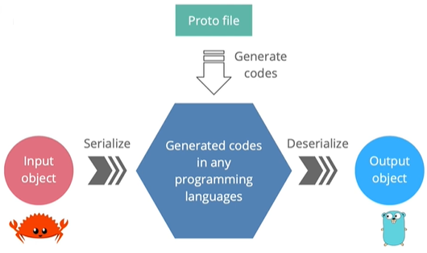

### 微服务可能用不同的语言编写

- 他们必须就API合同达成一致，以交换信息

通信通道：REST、SOAP、消息队列

身份验证机制：Basic、OAuth、JWT

有效负载格式：JSON、XML、二进制

o数据模型

o错误处理、

### 什么是gRPC？

- gRPC是一个高性能的开源功能丰富的RPC框架
- gRPC最初由谷歌开发
- 现在它是云计算原生计算基金会（Cloud Native Computing Foundation）CNCF的一部分
- g代表每个gRPC版本中的不同内容：gRPC、good、green、glority、game、gon
    - https://github.com/grpc/grpc/blob/master/doc/g_stands_for.md
- RPC代表远程过程调用

### 什么是远程过程调用？

- 它是一种允许程序运行的协议
    - 执行位于其他计算机中的另一个程序的程序
    - 没有开发人员为远程交互明确编码细节
- 在客户端代码中，看起来我们只是直接调用服务器代码的一个函数

- 客户机和服务器代码可以用不同的语言编写
    - 客户端使用Golang编写，服务端用Rust编写
    - 

### gRPC是如何工作的？


- 客户端有一个生成的存根，它提供与服务器相同的方法
- 存根在后台调用gRPC框架，通过网络交换信息
- 客户机和服务器使用存根进行交互，所以它们只需要实现它们的核心服务逻辑

### 存根是如何生成的

- API合同说明
    - 使用协议缓冲区定义服务和有效负载消息
- 服务器和客户端存根由
    - 协议缓冲区编译器
    - 每种语言的gRPC插件


### 为什么gRPC使用协议缓冲区（Protocol Buffer）？

- 人类可读接口定义语言（IDL）
    - 可互操作的编程语言
    - 多种语言的代码生成器
- 二进制数据表示：
    - 更小的尺寸
    - 运输速度更快
    - 序列化反序列化的效率更高
- 强类型合同
- API演进的约定
    - 前后兼容
- Alternative options
    - Google flatbuffers
    - Microsoft bond



### 什么使gRPC高效？

GRPC使用HTTP/2作为其传输协议

- .二进制帧
    - 更高效、更强健
    - 运输更轻，解码更安全
    - 与协议缓冲区的完美结合
- 使用HPACK的报头压缩
    - 减少开销并提高性能
- 多路复用
    - 并行发送多个请求和响应通过单个TCP连接
    - 减少延迟并提高网络利用率
- 服务器推送
    - 一个客户端请求，多个响应
    - 减少往返延迟

### HTTP/2如何在引擎盖下工作

- 单个TCP连接承载多个双向连接流
- 每个流都有一个唯一的ID和多个龋齿双向消息
- 每条消息（请求/响应）被分解为多个二进制帧
- 框架是承载不同类型的最小单元数据类型：标题、设置、优先级、数据等。
- 来自不同流的帧被交错并传输然后在另一侧重新组装

HTTP/2中新的二进制帧层启用流多路复用


- 客户端发一条消息，服务端发送一条响应
- 客户端发送多个消息流，服务端仅仅发送回一条响应
- 客户端发一条消息，服务端发送回多个服务端消息流
- 双向流传输，服务端和客户端发送多条消息，任何一方不需要在发送下一条消息之前等待响应

我们要实现一个笔记本电脑信息管理系统。

### 如何定义协议消息

- 消息名称：大驼峰
- 字段名称：lower_snake类型
- 一些标量值数据类型：
    - string，bool，byte
    - float，double
    - int32、int64、uint32、uint64、sint32、sint64等。
    - 数据类型可以是用户定义的枚举或其他消息
- 标记比字段名更重要
    - 是一个任意整数
        - 从1到536870911（或2^29-1）
        - 19000年至19999期间除外（保留）
    - 从1到15取1字节
    - 从16到2047取2字节
- 不需要按顺序或使他们有序
- 对于相同级别的字段必须是唯一的

### 枚举类型

```protobuf
syntax = "proto3";
message People{
  string name = 1;
  uint32 age = 2;


  enum Gender{
    option allow_alias = true; // 多个枚举类型的标识是一样的
    OTHER = 0; // 枚举必须要有一个tag为0的标识
    BOY = 1;
    MAN = 1;

    GIRL = 2;
    WOMAN = 2;
  }
  Gender gender = 3;
}
```
